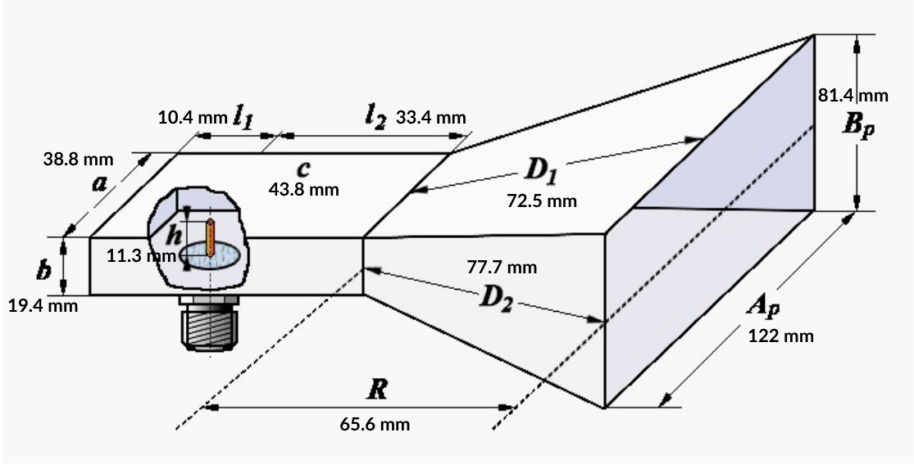

# Antenna Mechanical Models

This folder contains the CAD files, and physical specifications for the antenna.

## Design Preview & Dimensions

*Figure 1: Antenna geometry and key dimensions.*

---

## Files
* `Antenna_Design.SLDPRT` – Native SolidWorks part file.
* `Antenna_Design.STEP` – Universal CAD format for cross-platform compatibility.

## Manufacturing Specs
* **Material:** [Stainless Steel]
* **Feed Point Location:** [11.3 mm from edge]
