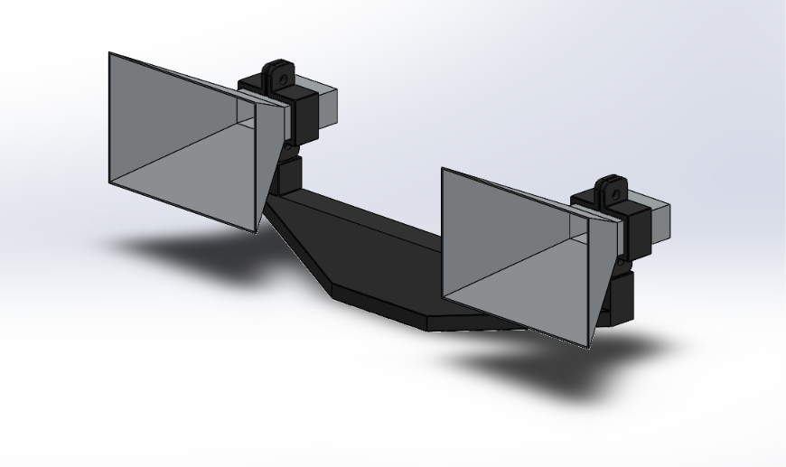

# Antenna & Mount Mechanical Assembly

This directory contains the CAD models, part files, and physical specifications for the dual 5.8 GHz FMCW pyramidal horn antenna array and crossbar mount assembly.

---

## Design Preview & Assembly Structure

*Figure 1: Dual horn antenna array with crossbar mounting frame and waveguide clips.*

### Primary Assembly Hierarchy
* **Top-Level Assembly:** `Final_Assy.SLDASM`
* **Sub-Assembly:** `Horn_Antenna_Single_Assy.SLDASM`

---

## File Inventory

### 1. SolidWorks Native Files (`.SLDASM` / `.SLDPRT`)
* **`Final_Assy.SLDASM`** – Full dual-antenna array and crossbar assembly.
* **`Horn_Antenna_Single_Assy.SLDASM`** – Sub-assembly for a single horn antenna with waveguide mount clip.
* **`Horn_Antenna_15dBi.SLDPRT`** – 15 dBi pyramidal horn antenna body.
* **`Antenna_Mount_Crossbar.SLDPRT`** – Main structural crossbar mounting frame.
* **`Waveguide_Mount_Clip.SLDPRT`** – Waveguide retaining clip for mechanical stability.

### 2. Universal Formats (`.STEP`)
* **`STEP/Final_Assy.STEP`** – Universal AP214 / AP242 STEP export for cross-platform CAD software and manufacturing.

---

## Fabrication & Manufacturing Specs

| Component | Fabrication Method / Material | Key Notes |
| :--- | :--- | :--- |
| **Horn Antenna Body** | Handmade (Welded Stainless Steel) | Custom sheet metal fabrication; designed for **15 dBi target gain** @ 5.8 GHz |
| **Crossbar Mount** | 3D-Printed (PLA/PETG) | Structural frame aligning dual horn antennas with fixed spacing |
| **Waveguide Mount Clip** | 3D-Printed (PLA/PETG) | Custom clip securing stainless steel horns to crossbar support |

---

## Usage Notes
1. **Opening in SolidWorks:** Open **`Final_Assy.SLDASM`** directly. Keep all `.SLDPRT` files in the same directory to prevent missing component references.
2. **Cross-Platform / Viewing:** Open **`STEP/Final_Assy.STEP`** in non-SolidWorks software (such as Fusion 360, FreeCAD, or web viewers) to inspect 3D geometry and colors.
