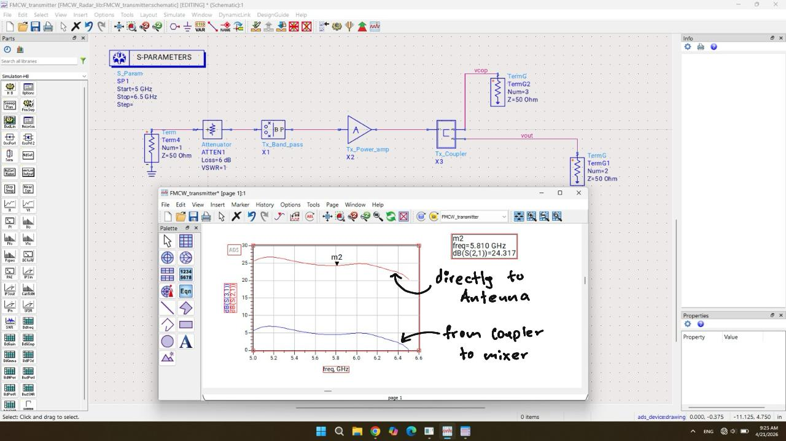
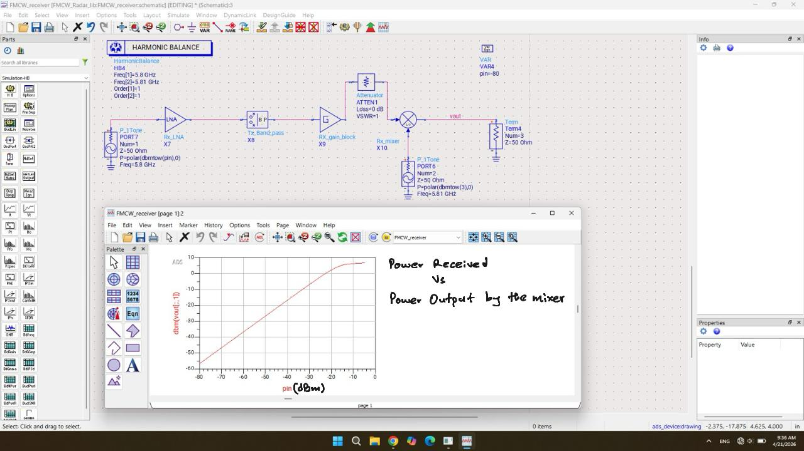

# 5.8 GHz FMCW Radar RF Front-End Architecture and Simulations

This repository details the RF front-end design, simulation, and analysis for a 5.8 GHz Frequency Modulated Continuous Wave (FMCW) radar system, developed specifically for integration into advanced traffic control systems. The simulations evaluate the performance of both the transmitter (Tx) and receiver (Rx) chains, ensuring signal integrity, adequate amplification, and accurate downconversion of the radar chirp.

## Keysight Advanced Design System (ADS)

The design and validation of the RF front-end rely extensively on Keysight Advanced Design System (ADS). ADS is utilized here to model complex RF behaviors that cannot be easily derived from standard datasheets. 

The simulation suite employs two primary analysis engines:
1.  **S-Parameter Analysis:** Used to evaluate the linear characteristics of the passive and active networks, ensuring proper impedance matching, optimal power transfer, and precise frequency response (gain and return loss) across the 5.8 GHz operating band.
2.  **Harmonic Balance Analysis:** A frequency-domain analysis technique essential for evaluating the non-linear behavior of the active components in the system. This is heavily utilized to determine critical performance metrics such as the 1dB compression point (P1dB) of amplifiers and the intermodulation distortion characteristics (like OIP3) of the downconversion mixer.

## System Components

The RF front-end is divided into two cascaded subsystems:

### 1. Transmitter (Tx) Chain
*   **Attenuator (6 dB):** Stabilizes the source impedance and prevents overloading of subsequent sensitive stages.
*   **Bandpass Filter:** Rejects out-of-band harmonics and phase noise from the FMCW signal generator, ensuring spectral purity before amplification.
*   **Power Amplifier (PA):** Amplifies the clean FMCW chirp to the required transmission power. 
*   **Directional Coupler:** Splits the amplified signal. The primary power is directed to the transmission antenna, while a tightly coupled fraction of the signal is routed directly to the receiver's mixer to serve as the Local Oscillator (LO) reference.

### 2. Receiver (Rx) Chain
*   **Low Noise Amplifier (LNA):** The most critical component in the Rx chain. It amplifies the extremely weak signal reflected from traffic targets without adding significant thermal noise.
*   **Bandpass Filter:** Isolates the 5.8 GHz band, rejecting interference from adjacent communication bands (like 5 GHz Wi-Fi).
*   **Rx Gain Block:** Provides secondary amplification to ensure the signal level is optimized for the mixer's RF input port.
*   **Mixer (ADL5801):** An active mixer used to multiply the reflected RF signal with the coupled LO signal from the transmitter. Because specific non-linear parameters—such as OIP3 and P1dB—are not always explicitly detailed in the provided documentation for the ADL5801, rigorous Harmonic Balance simulations were necessary to empirically determine its power handling limitations and conversion gain under real-world LO drive levels.

---

## Simulation Results and Detailed Explanations

### Transmitter Subsystem Analysis

The transmitter must deliver high power to the antenna while maintaining linearity. The cascaded simulation evaluates the full path from the source, through the attenuator, filter, PA, and coupler.

**Tx Schematic and S-Parameter Performance**
The schematic captures the full Tx cascade. The primary objective is verifying the gain delivered to the antenna port while monitoring the coupled LO power.

*The S-parameter simulation shows a forward transmission gain (S21) of 24.317 dB at exactly 5.810 GHz delivered to the antenna. The lower trace highlights the power coupled to the mixer, which must be carefully tuned to provide an optimal LO drive level without saturating the mixer.*

**Cascaded Tx Frequency Response**

*This broadband S21 plot illustrates the frequency response of the entire cascaded transmitter. The system exhibits a wide, flat gain profile centered around the 5.8 GHz FMCW bandwidth, ensuring that as the chirp sweeps across frequencies, the transmitted power remains consistent.*

**Power Amplifier and Filter Characteristics**

*Simulation focusing on the TQP5523 power amplifier and its associated bandpass characteristics. This confirms the sharp roll-off needed to suppress out-of-band emissions, which is strictly regulated in traffic radar applications.*

**Tx Power Transfer and Compression**

*These plots detail the absolute power transfer of the Tx chain. Tracking the magnitude and dBm of the output against the input power is critical to establishing the maximum linear operating region before the PA reaches its 1dB compression point.*

---

### Receiver Subsystem Analysis

The receiver must detect faint reflections, amplify them linearly, and mix them with the Tx reference to produce the Intermediate Frequency (IF) beat signal used for ranging and velocity calculations.

**Receiver Schematic and Harmonic Balance**

*The Rx cascade incorporating the LNA, filtering, and the ADL5801 mixer. The Harmonic Balance analysis sweeps the received RF input power from -80 dBm upwards. The resulting curve maps the downconverted IF power output from the mixer. This simulation is strictly required to establish the dynamic range of the receiver and map the saturation point of the downconversion process.*

**LNA Gain Compression (P1dB)**

*This graph explicitly maps the output power (dBm) versus input power (dBm) for the front-end LNA. The linear slope represents the LNA's small-signal gain. As input power increases (simulating a target at extremely close range), the curve flattens. Identifying this P1dB compression point is essential to prevent system blinding when highly reflective traffic vehicles pass near the radar.*
