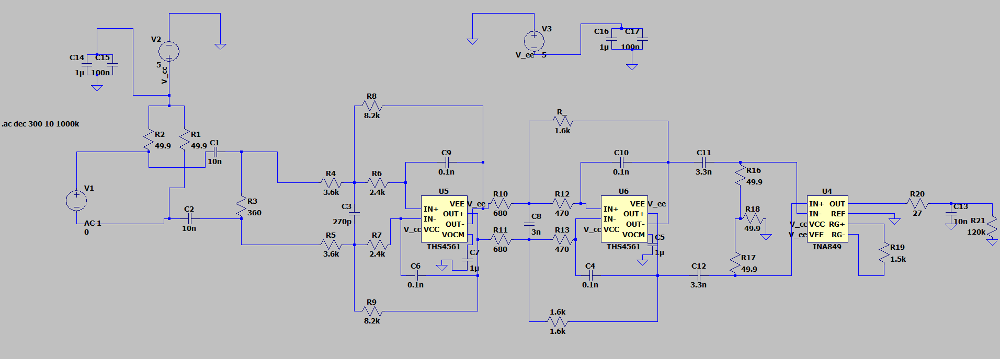
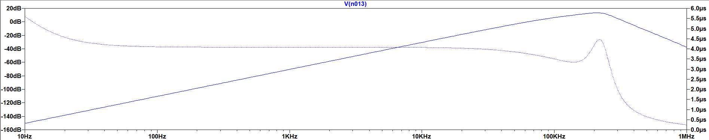
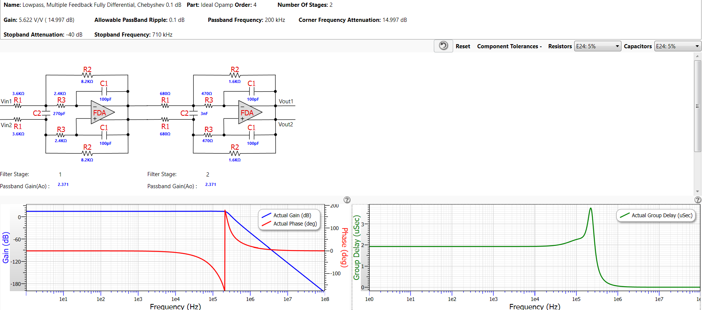

# Video Filtering Simulation

## Overview

This directory contains the LTSPICE simulation for the video filtering stage of the FMCW Radar system. The filter conditions the received signal after the mixer stage, preparing it for ADC and subsequent signal processing.

---

## Main Circuit Architecture (Updated)

### Original Architecture

- A second-order high-pass Chebyshev (0.1 dB ripple) active stage followed by a passive low-pass stage.
- Rationale: a high-pass to provide linear gain increase with frequency and a passive low-pass to attenuate high-frequency noise.

### What Changed

- We moved to a passive high-pass implementation composed of two cascaded second-order passive high-pass stages (two-stage passive high-pass) followed by an active low-pass stage.
- The low-pass is now an active 4th-order Chebyshev filter with 0.1 dB ripple designed using FilterPro by Texas Instruments.
- Reason: the active low-pass Chebyshev (4th order) provides steeper attenuation beyond the intended passband, which better rejects out-of-band energy (e.g., reflections from distant objects) that can introduce artifacts in range and velocity estimates.

---

## Filter Design

### Architecture (Now)

- Passive High-Pass: Two cascaded second-order passive high-pass stages (implemented with the same resistor and capacitor values as before).
- Active Low-Pass: 4th-order Chebyshev low-pass (0.1 dB ripple) designed using FilterPro by Texas Instruments and implemented with the THS4561 op-amp.

### Key Characteristics

| Parameter | Value | Purpose |
|-----------|-------|---------|
| Filter Type | Passive High-Pass (2x 2nd order) + Active Low-Pass (4th order Chebyshev) | Bandpass-like conditioning of video signal with steep out-of-band attenuation |
| High-Pass Order | 2nd Order (two stages) | Removes DC/very-low-frequency content and shapes low-frequency response |
| Low-Pass Order | 4th Order Chebyshev (0.1 dB ripple) | Strong attenuation beyond the passband to mitigate distant object reflections and mixing products |
| Ripple Specification | 0.1 dB | Minimal passband distortion in the low-pass section |
| Topology | Passive RC (HP) + Multiple-Feedback (active LP) | Trade-off: passive HP avoids active noise injection near DC, active LP provides precise, steep rolloff |
| Design Tool | FilterPro (Texas Instruments) | Optimized component values and topology for the active low-pass section |
| Components | Same resistors & capacitors as prior design | Eases BOM changes and leverages previously validated parts |

### Design Rationale (Updated)

1. Higher attenuation beyond the expected receive region to reduce contribution from distant objects and spurious high-frequency energy.
2. Passive high-pass stages remove DC and sub-kHz content without adding active-stage noise or offset.
3. A 4th-order Chebyshev active low-pass gives a steeper stopband than the prior passive LP, improving suppression of out-of-band interference while keeping controlled passband ripple (0.1 dB).
4. FilterPro by Texas Instruments was used to optimize the component values and ensure the multiple-feedback topology provides predictable, high-performance Chebyshev response with good component tolerance characteristics.

---

## Circuit Components

The updated circuit uses the same components as previously specified; the topology and staging are changed but component families and values remain.

### Filter Circuit Diagram

### Active Components
- **U4**: INA849 Instrumentation Amplifier (gain stage)
- **U5**: THS4561 Op-Amp (active low-pass multiple-feedback sections)

### Passive Components
- **Resistors**: Multiple feedback network resistors (1k, 4.99k, 49.9Ω, 422Ω, 120kΩ values) used both in passive HP networks and active LP feedback networks where appropriate
- **Capacitors**: Filtering capacitors (1n, 2.4n, 10n values) used in the passive high-pass stages and in the multiple-feedback low-pass
- **High-pass elements**: Implemented as passive RC networks in two cascaded stages

### Power Supply
- **Dual Supply**: ±5V
- **Decoupling**: Multiple bypass capacitors (1μ, 100n) on supply rails

---

## Simulation Details

### Simulation Tool
- **Software**: LTSPICE (version 4.1)
- **Analysis Type**: AC Frequency Sweep
- **Filter Design Tool**: FilterPro by Texas Instruments (low-pass stage)

### Frequency Response Analysis

| Parameter | Value |
|-----------|-------|
| Start Frequency | 10 Hz |
| Stop Frequency | 1 MHz |
| Points per Decade | 300 |
| Sweep Type | Logarithmic (decade) |

### Expected Performance (Updated)

- **Passband**: Low frequencies below the high-pass cutoff are attenuated; the effective passband begins above the HP cutoff and remains shaped by the active LP.
- **Peak Response**: The design preserves gain shaping around the expected receive frequency (~200 kHz), but the dominant change is stronger attenuation above the passband.
- **Attenuation Rate**: The 4th-order active Chebyshev low-pass produces a much steeper stopband than the previous passive LP, improving rejection beyond the intended region.
- **Stopband**: Active LP provides controlled ripple in passband and steep rolloff into stopband to mitigate distant-object energy and mixing artifacts.

### Frequency and Phase Response

---

## Low-Pass Filter Design (FilterPro)

The active low-pass stage was designed using Texas Instruments' FilterPro tool to achieve optimal 4th-order Chebyshev performance:

---

## Files

- `fmcw fliter - Copy (2).asc` - LTSPICE schematic file containing the complete filter circuit (updated to reflect passive two-stage HP and active 4th-order Chebyshev LP designed with FilterPro)

---

## Usage

### To Open/Simulate in LTSPICE:

1. Open LTSPICE (version 4.1 or compatible)
2. File → Open → Select `fmcw fliter - Copy.asc`
3. Click the simulation icon or press Ctrl+R
4. The AC frequency sweep will execute from 10 Hz to 1 MHz

### Expected Output:

- **Bode Plot**: Shows magnitude response with low-frequency attenuation (from the passive HP stages) and a controlled passband followed by a steep rolloff from the 4th-order Chebyshev low-pass
- **Phase Response**: Shows phase shift through the passive HP and active LP stages

---

## Performance Specifications (Updated)

- **Input Impedance**: High (determined by instrumentation amplifier)
- **Output Impedance**: Low (suitable for ADC input or subsequent processing)
- **Noise Performance**: Improved in the low-frequency region by using passive HP stages; overall SNR benefits from steep LP attenuation of out-of-band noise
- **Bandwidth (operating region)**: Designed to remove DC/sub-kHz content, operate effectively up to ~200 kHz with strong attenuation beyond; effective simulation region up to ~1 MHz
- **Group Delay**: Approximately constant across the intended operating region to preserve signal integrity, subject to the Chebyshev phase characteristics in the passband
- **Gain**: Frequency-dependent, shaped to match receive characteristics and to attenuate undesired regions

---

## Design Notes (Updated)

1. Using cascaded passive high-pass stages suppresses DC and sub-kHz energy without introducing active-stage offsets or additional active noise at those frequencies.
2. The 4th-order Chebyshev active low-pass (0.1 dB ripple) was designed using FilterPro by Texas Instruments to provide steep rolloff and reject energy from distant objects and other out-of-band signals that would otherwise corrupt range and velocity measurements.
3. Multiple-feedback topology is used in the active low-pass sections to realize the Chebyshev response compactly and with predictable sensitivity to component tolerances, as recommended by FilterPro.
4. Component tolerances should be maintained within ±1% for accurate frequency response; if tighter matching is required, consider 0.1% resistors in critical nodes.

---

## Future Improvements

- PCB layout optimization for EMI/EMC performance
- Prototype testing and measurement validation; test the PCB and adjust the INA849 gain using resistor R19
- Frequency response tuning based on actual system measurements; the active LP component values or damping may be adjusted if measured passband ripple or cutoff differs from simulation

---

## References

- LTSPICE Documentation
- FilterPro by Texas Instruments (Filter Design Tool)
- INA849 Instrumentation Amplifier Datasheet
- THS4561 Op-Amp Datasheet

---

**Status**: LTSPICE Simulation Phase
